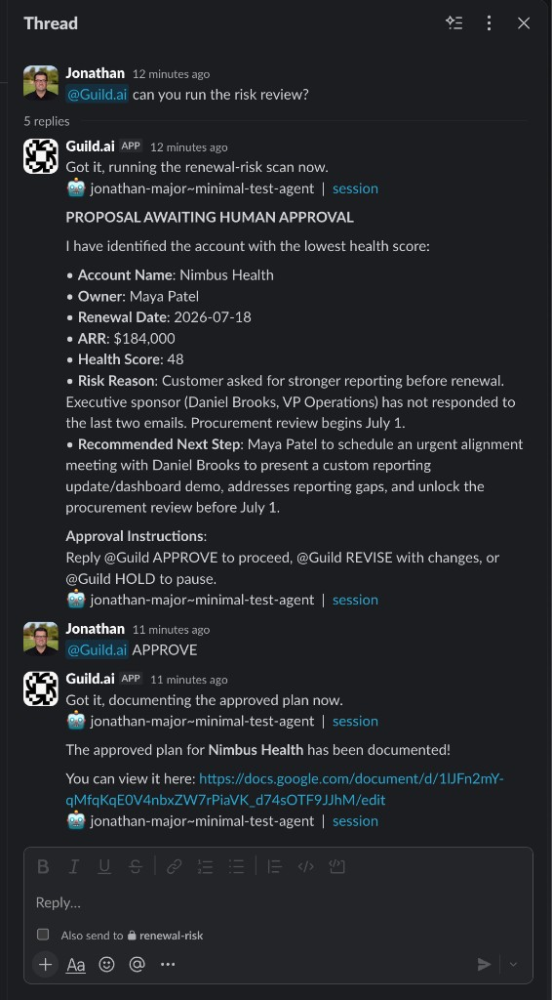
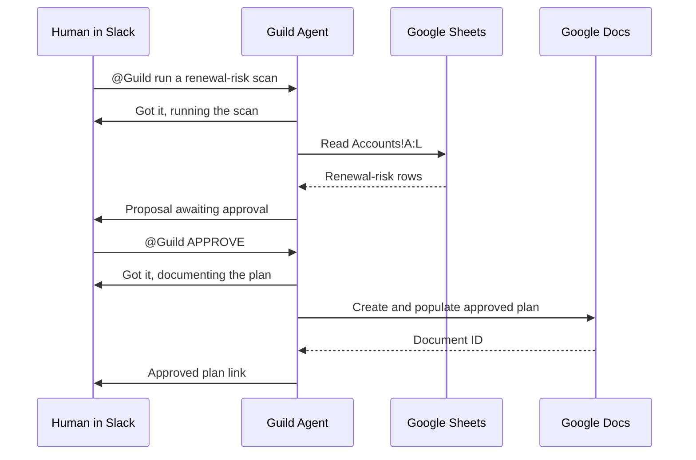

# Renewal Risk Command Center

A Guild.ai agent demo that turns a static renewal-risk spreadsheet into a Slack-based, human-approved workflow.

The agent reads account health data from Google Sheets (for Demo purposes), identifies the highest-risk renewal, posts a proposed action plan to Slack, waits for human approval, creates an approved plan in Google Docs, and posts the document link back to Slack.

## Problem

Customer Success and Revenue teams often have renewal-risk signals spread across spreadsheets, CRM records, support notes, finance data, and Slack conversations. The operational gap is not only identifying the account at risk, but coordinating the next action with the right human in the loop.

This demo focuses on that coordination layer:

- Read renewal-risk data from a shared source of truth.
- Identify the account that needs attention.
- Propose a clear mitigation plan in Slack.
- Require human approval before creating an official action document.
- Leave an audit-friendly document link in the same collaboration surface.

## Solution With Guild

Guild provides the agent runtime, tool integrations, validation, publishing, and Slack trigger infrastructure. The agent is implemented as a TypeScript `llmAgent` with a small set of tools:

- Google Spreadsheets OAuth: read renewal account data.
- Slack: acknowledge requests, post proposals, and post final document links.
- Google Docs OAuth: create and populate the approved renewal plan.

The current demo intentionally uses Slack for human approval. It keeps the approval step in the same collaboration surface where Customer Success and Revenue teams already coordinate.

## Current Demo Flow





1. A user mentions the Guild agent in Slack and asks it to run the renewal-risk scan.
2. The agent replies that it is working on the scan.
3. The agent reads the Accounts sheet.
4. The agent posts a proposal for the lowest-health renewal account.
5. A human replies with `@Guild APPROVE`.
6. The agent acknowledges the approval.
7. The agent creates and updates a Google Doc with the approved plan.
8. The agent posts the Google Doc link back to Slack.

## What Is Not Integrated Yet

This is a focused demo, not a full production renewal platform.

Not yet included:

- CRM integration for account owner, opportunity, stage, activity, and forecast data.
- Finance integration for ARR, invoice status, expansion history, or payment risk.
- Support integration for open tickets, severity trends, or SLA breaches.
- Product usage integration for adoption and engagement signals.
- Persistent approval state outside Slack/Guild session context.

The current spreadsheet stands in for those systems so the workflow can be demonstrated end to end.

## Repository Layout

```text
agent.ts                         Guild TypeScript agent
README.md                        Public overview and quickstart
docs/setup.md                    Guild CLI, OAuth, and Slack setup
docs/demo-runbook.md             End-to-end demo script
docs/architecture.md             Runtime flow and integration notes
examples/accounts.csv            Example spreadsheet data
```

## Quickstart

1. Install and authenticate the Guild CLI.
2. Configure npm for the Guild package registry using `.npmrc.example`.
3. Connect Slack, Google Spreadsheets OAuth, and Google Docs OAuth credentials in Guild.
4. Create a Slack channel such as `#renewal-risk`.
5. Create a Google Sheet using `examples/accounts.csv`.
6. Update `agent.ts` with your spreadsheet ID and sheet range if needed.
7. Save and publish the agent with Guild.
8. Mention the agent in Slack to run the demo.

For detailed setup, see `docs/setup.md`.

## Example Slack Prompts

Start the scan:

```text
@Guild run a renewal-risk scan
```

Approve the proposal:

```text
@Guild APPROVE
```

For the most reliable demo, approve in the same Slack thread or channel where the proposal appears and include the Guild app mention.

## Development

Build locally:

```bash
cp .npmrc.example .npmrc
npm install
npm run build
```

Publish with Guild:

```bash
guild agent save -A --message "Describe the change" --publish --wait --bump patch
```

If local dependency installation is unavailable, Guild remote validation still installs dependencies and builds the agent during `guild agent save`.
