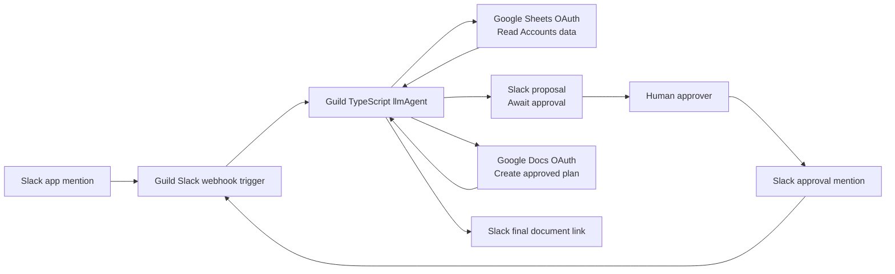
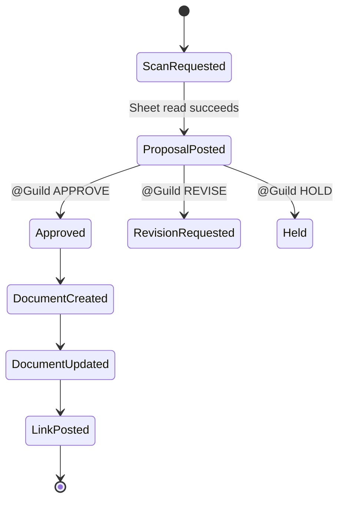

# Architecture

The Renewal Risk Command Center is a Guild TypeScript agent that coordinates a small, human-approved renewal workflow.

## Runtime Components



## Workflow State



## Agent Tools

The agent currently exposes only the tools it needs:

- `google_spreadsheets_oauth_spreadsheets_values_get`
- `google_docs_oauth_documents_create`
- `google_docs_oauth_documents_batch_update`
- `slack_chat_post_message`
- `slack_conversations_list`

The Slack channel is selected from the incoming Slack webhook payload when possible:

```text
event.channel
```

For manual runs without a Slack webhook payload, the agent falls back to `slack_conversations_list` and looks for `#renewal-risk`.

## Approval Model

The approval surface is Slack.

The agent posts a proposal and instructs the human to respond with:

```text
@Guild APPROVE
@Guild REVISE ...
@Guild HOLD
```

The current implementation treats approval as a new Slack-triggered turn. If the prior proposal is not available in model context, the agent re-reads the spreadsheet and reconstructs the plan from source data before creating the Google Doc.

## Why Slack For Approval

Slack is the approval surface for this demo because renewal workflows already happen in team collaboration channels. Keeping the proposal, human approval, and final document link in one Slack thread makes the flow easy to demo and easy for stakeholders to follow.

## Data Model

The demo spreadsheet uses this shape:

```text
Account
Segment
Owner
Renewal Date
ARR
Health Score
Risk Status
Primary Risk
Recommended Action
Executive Sponsor
Last Touch
Notes
```

The agent identifies the riskiest account by lowest health score.

## Current Limitations

This repo demonstrates orchestration, not a complete renewal intelligence platform.

Current limitations:

- Spreadsheet-only account data.
- No CRM account/opportunity integration.
- No finance or billing integration.
- No product usage telemetry.
- No support ticket or escalation integration.
- No durable approval state store outside Slack/Guild session context.
- Approval parsing is prompt-based rather than a typed workflow state machine.

## Production Extension Points

### CRM

Potential fields:

- Account owner
- Customer tier
- Opportunity amount
- Renewal date
- Stage
- Last activity
- Executive sponsor
- Open tasks

Potential systems:

- Salesforce
- HubSpot
- Gainsight

### Finance

Potential fields:

- ARR
- Renewal amount
- Expansion/contraction history
- Invoice status
- Payment risk
- Contract terms

Potential systems:

- Stripe
- NetSuite
- QuickBooks
- Chargebee

### Product Usage

Potential fields:

- Active users
- Feature adoption
- Login trend
- Usage drop-off
- License utilization

### Support

Potential fields:

- Open tickets
- Critical incidents
- SLA breaches
- Sentiment
- Escalation status

## Production Hardening Ideas

- Move spreadsheet ID and default Slack channel into configuration.
- Add typed approval states.
- Persist approval records in a durable store.
- Include test fixtures for proposal generation.
- Add CI validation for TypeScript build and Guild metadata extraction.
- Replace prompt-only flow control with a deterministic workflow wrapper where possible.
